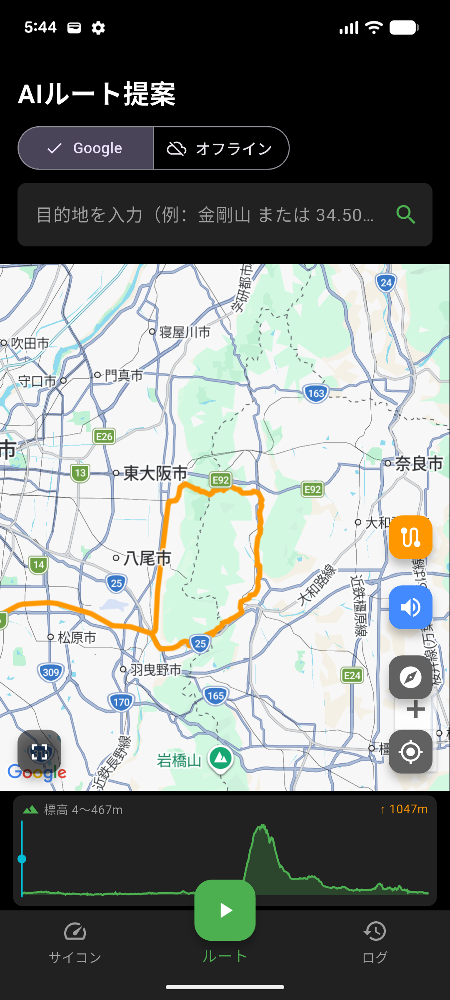
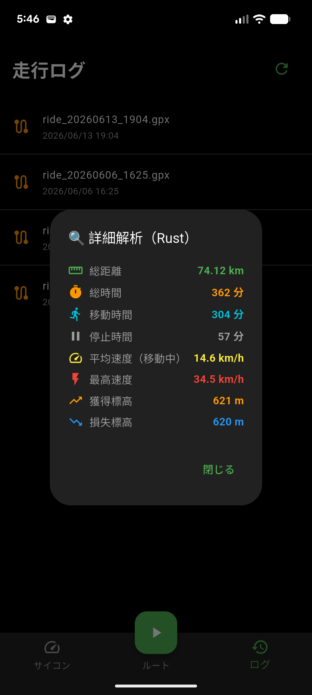
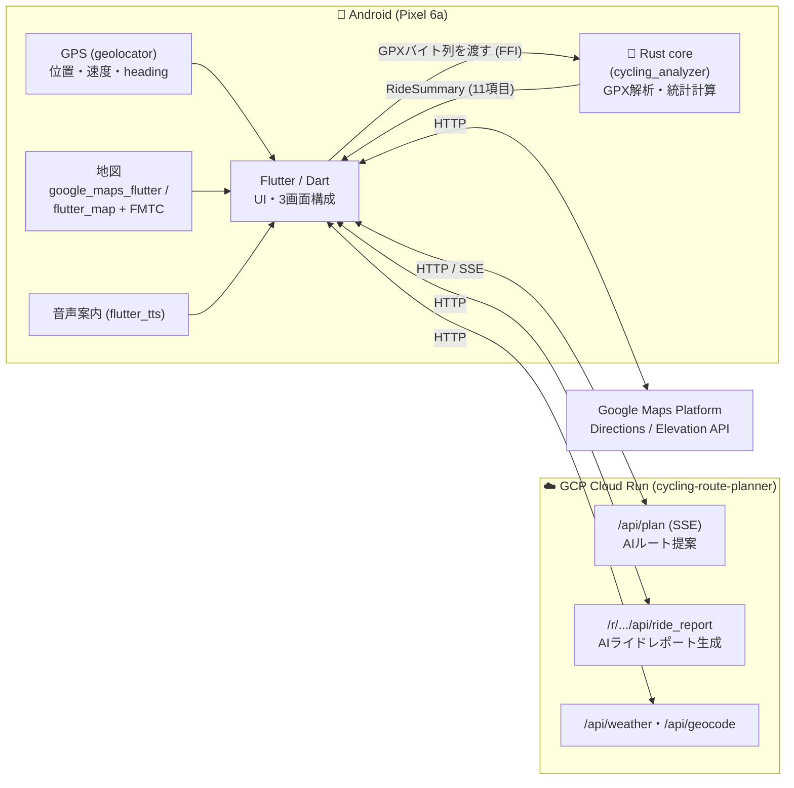

# 🚴 cycling_computer

> A self-built bike computer for Android, written in **Flutter + Rust**.
> Real-time ride metrics on the phone (Dart/GPS), high-accuracy GPX analytics in a native Rust core (via flutter_rust_bridge), and AI route/report generation on a Cloud Run backend.

**Flutter + ネイティブ(Rust) でモバイルアプリを設計・実装した個人開発プロジェクト**です。
スマホ単体で動くサイクルコンピュータとして、走行中のライブ表示（Dart/GPS）と、
走行ログ（GPX）の高精度解析（Rust）を二層構成で実装しています。AI によるルート提案・
ライドレポート生成はバックエンド（[cycling-route-planner](https://github.com/FujiiNoritsugu/cycling-route-planner)）と連携します。

実機 **Google Pixel 6a（Android 16）** で動作し、グラベルバイク（Cannondale Topstone 4）での
実走運用を前提に開発しています。

---

## 📸 スクリーンショット / デモ

> ※ブラウザで触れるデモはありません。実機での動作を画像/動画で示します。**画像は後日追加予定**（以下はプレースホルダ）。

| サイコン画面（ライブ計測） | ルート画面（AI提案 + 地図） | 解析ダイアログ（Rust） |
|---|---|---|
|  |  |  |

| 走行中（ヘディングアップ + 音声案内） | 標高プロファイル | オフライン地図（OSM/FMTC） |
|---|---|---|
|  |  |  |

---

## 🧭 これは何か

市販サイコンの代わりに、手持ちの Android スマホをハンドルにマウントして使う
自作サイクルコンピュータです。次の3画面で構成しています。

- **サイコン画面** — 速度・高度・気温などのライブ表示と、走行記録（GPX保存）
- **ルート画面** — AIによるルート提案、地図表示、GPX読み込み、音声ターン案内、ルート逸脱検知
- **ログ画面** — 保存済みGPXの一覧と、Rustコアによる詳細解析

---

## 🏗️ アーキテクチャ



### なぜ Flutter + Rust の二層構成にしたか

| 層 | 担当 | 採用理由 |
|---|---|---|
| **Flutter / Dart** | UI・地図・GPS・センサー入力・ライブ表示・通信 | クロスプラットフォームUIと地図/位置情報エコシステムが充実。1コードベースで実機UIを素早く構築できる。 |
| **Rust（native core）** | GPX解析・距離/速度/標高/移動時間の計算 | 計算ロジックを**UIから分離した純粋関数**として実装。Rust側は I/O も UI も持たず、`bytes → struct` の決定的な変換に徹する。これにより**ネイティブのテスト（cargo test）で実データ検証ができ**、計算の正しさをUIと独立に担保できる。`flutter_rust_bridge` で型安全に橋渡しする。 |

ポイントは「**計算の正しさを、UIから切り離して検証可能にする**」という設計判断です。
速度・獲得標高のような“数字の正確さがアプリの価値そのもの”になる領域を、
GUIに埋め込まず独立したコアに置き、Strava実測値との比較テストで裏付けています。

---

## ✨ 技術的なハイライト

### 1. 計算コアを Rust に分離し、実データで精度検証

GPX解析は Dart ではなく Rust（[cycling_analyzer](https://github.com/FujiiNoritsugu/cycling_analyzer)）に置いています。
理由は **「数字の正確さを独立にテストしたい」**から。コアは副作用を持たない純粋関数群で、
`cargo test` 上で実走データと突き合わせています。

- **獲得標高**: 生の標高列をそのまま加算するとGPSノイズで過大計上になる。
  そこで「移動平均で平滑化 → 3mのしきい値を超えた分だけ累積」する2段アルゴリズムを実装。
  合成ノイズデータで「平滑化なし=過大、平滑化あり=真値±20%」を回帰テスト化。
- **最高速度**: 単純な瞬間最大はGPSの飛びで非現実値になるため、3点移動平均をとり
  80km/h超を除外。実データ（林道 Strava 56.2km/h、平地 39.8km/h）で範囲検証。
- **移動/停止時間**: 速度を平滑化し 4.5km/h 未満を停止扱い。Strava の auto-pause 挙動に
  寄せて調整。実走の移動時間（6:47:09 等）と平均移動速度（13.2km/h 等）を範囲検証。

> 依存は `gpx` と `time` のみの軽量コア。FFI境界は `parse_gpx_and_summarize(bytes) -> RideSummary` の1関数に絞り、橋渡しを単純化。

### 2. ライブ計測は Dart/GPS、解析は Rust という役割分担

走行中のリアルタイム表示（速度・高度・heading）は `geolocator` の位置ストリームで
Dart 側が処理し、保存済みGPXのバッチ解析を Rust が担います。
**リアルタイム性が要る処理とバッチ計算を意図的に分離**しています
（高度・速度はGPS由来。気圧センサー等の追加ハードウェアは使用していません）。

### 3. オンライン/オフライン両対応の地図

`google_maps_flutter`（オンライン・Directions/Elevation連携）と
`flutter_map` + `flutter_map_tile_caching`（OSMタイルのオフラインキャッシュ）の
2系統をタブで切替。電波の弱い山間部の走行を想定し、ルート沿いのタイルを事前取得できる
構成にしています。進行方向を上に固定する**ヘディングアップ**表示にも対応。

### 4. 走行支援機能

`flutter_tts` による**音声ターン案内**、**ルート逸脱検知**、**標高プロファイル**表示など、
走行中にスマホを注視せず使うための機能を実装。heading は移動中（>1m/s）のみ採用して
停止時のふらつきを抑えるなど、実走で気づいた挙動を反映しています。

### 5. シークレットをソースに直書きしない設計

APIキー等は**コードにハードコードしない**方針で統一しています。

- Dart 側: `lib/secrets.dart`（`.gitignore` 済み）から定数注入。リポジトリには
  プレースホルダの `lib/secrets.dart.example` のみを含める。
- Android 側: `MAPS_API_KEY` を `android/local.properties` から
  `manifestPlaceholders` 経由で注入。

### 6. 「記録 → 物語生成」までを見据えたシステム群

本アプリ単体に閉じず、バックエンド [cycling-route-planner](https://github.com/FujiiNoritsugu/cycling-route-planner)
と連携します。`/api/plan` で**AIルート提案（SSEストリーミング）**を受け取り、
走行後は `/api/ride_report` に記録を送って**AIライドレポート**を生成。
「走る前の計画 → 走行 → 走った後の振り返り」を一連の流れとして設計しています。

---

## 🛠️ セットアップ / 開発

### 前提

| 項目 | バージョン / 内容 |
|---|---|
| Flutter / Dart SDK | Dart `^3.11.4`（対応する Flutter stable） |
| Rust ツールチェイン | **stable**（`rustup`）。`flutter_rust_bridge 2.12.0` を利用 |
| Android | Android SDK / NDK は Flutter が管理。Rust の Android 向けビルドは **cargokit（`rust_builder`）が `flutter build` 時に自動実行** |
| ネイティブコア | [`cycling_analyzer`](https://github.com/FujiiNoritsugu/cycling_analyzer)（Rustコア）を**親ディレクトリに並べて配置**（`pubspec.yaml` が `path: ../cycling_analyzer` で参照） |

> **Rust の事前ビルドや codegen は通常不要**です。生成済みの FFI バインディングは
> `cycling_analyzer` にコミットされており、Rust 本体は Flutter のビルド時に自動コンパイルされます。
> （`flutter_rust_bridge_codegen` が必要になるのは、Rust 側 API を変更してバインディングを
> 再生成するときだけです。）

### 手順

```bash
# 1. cycling_analyzer（Rustコア）と本リポジトリを「同じ親ディレクトリ」に並べて配置する
#    例:
#      workspace/
#      ├── cycling_analyzer/   ← path: ../cycling_analyzer で参照される
#      └── cycling_computer/   ← 本リポジトリ
git clone https://github.com/FujiiNoritsugu/cycling_analyzer.git
git clone https://github.com/FujiiNoritsugu/cycling_computer.git
cd cycling_computer

# 2. シークレットを設定（実キーはコミットされない）
cp lib/secrets.dart.example lib/secrets.dart
#    lib/secrets.dart を開き、googleApiKey 等に自分のキーを設定

# 3. Android 側マップキー（任意・Googleマップタブを使う場合）
#    android/local.properties に  MAPS_API_KEY=<your_key>  を追記

# 4. 取得 & 実行（実機推奨）。Rust は cargokit が自動ビルドする
flutter pub get
flutter run
```

> Rust コア単体のテスト・詳細は [cycling_analyzer リポジトリ](https://github.com/FujiiNoritsugu/cycling_analyzer) を参照してください。

### APIキーに付けるべき制限（セットアップ時の注意）

発行する Google API キーには制限を必ず設定してください。

- **アプリケーション制限（Android）**: パッケージ名 `com.fujii.cycling_computer` ＋ 署名証明書の SHA-1
- **API制限**: Maps SDK for Android / Directions API / Elevation API のみに限定

---

## 🧪 テスト / 既知の制約

### テスト
計算コア（[cycling_analyzer](https://github.com/FujiiNoritsugu/cycling_analyzer)）に対し
`cargo test` で精度・不変条件を検証しています。

- **実走データ（Strava実測値）との比較**: 獲得標高・最高速度・移動時間・平均移動速度を
  実際のライド（林道/平地）で範囲検証。
- **GPSノイズ平滑化の回帰テスト**: 平滑化が獲得標高の過大計上を抑えることを合成データで検証。
- **不変条件**: 移動時間 + 停止時間 ≒ 経過時間、往復ライドでは獲得≒損失、等。

```bash
# cycling_analyzer を配置済みの前提
cd ../cycling_analyzer/rust
cargo test
```

### 既知の制約（正直に）
- **リリース署名は未整備**。現状 `release` ビルドもデバッグ署名を流用しており、
  ストア配布用の署名設定は今後の課題。
- **対象は Android（Pixel 6a / Android 16 で確認）**。iOS/デスクトップのビルド構成は
  Flutter 既定のまま、動作確認は行っていない。
- ライブ高度・速度は **GPS由来**。気圧高度計やケイデンス/心拍センサーには非対応。
- 一部の地図機能（Directions/Elevation）は有効な Google API キーが必要。

---

## 🔗 関連プロジェクト

「**計画 → 走行 → 振り返り**」を、次の3リポジトリで1つのシステム群として構成しています。

| リポジトリ | 役割 | フェーズ |
|---|---|---|
| [cycling-route-planner](https://github.com/FujiiNoritsugu/cycling-route-planner) | GCP Cloud Run バックエンド。AIルート提案・ライドレポート生成 | 計画 / 振り返り |
| **[cycling_computer](https://github.com/FujiiNoritsugu/cycling_computer)**（本リポジトリ） | Android クライアント（Flutter + Rust）。ライブ計測・地図・記録 | 走行 |
| [cycling_analyzer](https://github.com/FujiiNoritsugu/cycling_analyzer) | GPX解析の Rust 計算コア（flutter_rust_bridge） | 走行（解析） |

クライアント（Flutter+Rust）とバックエンド（Cloud Run + AI）を自分で設計・実装し、
3リポジトリを横断して1つのプロダクトに仕立てています。

---

## 📄 ライセンス

MIT License — Copyright (c) 2026 FujiiNoritsugu

詳細は [LICENSE](LICENSE) を参照してください。

---

## 👤 作者

Fujii Noritsugu — [GitHub](https://github.com/FujiiNoritsugu)
